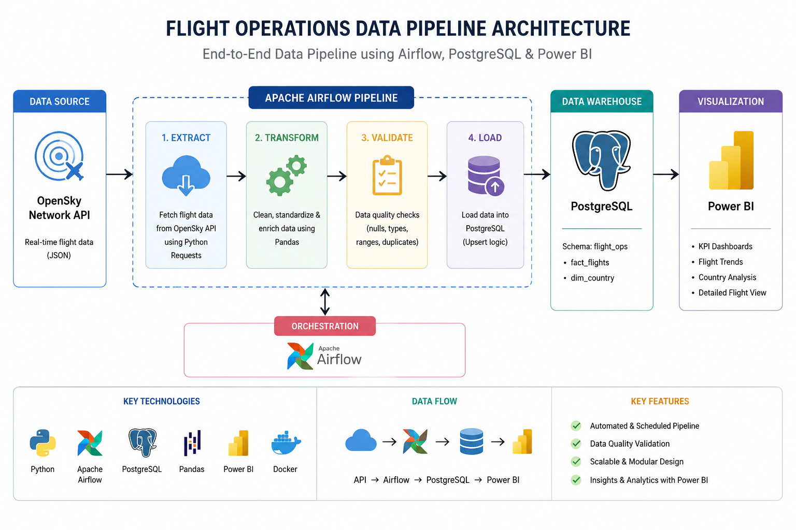

# ✈️ Flight Operations Data Pipeline

An end-to-end data engineering project that collects flight data from the OpenSky Network API, processes and validates the data using Python and Apache Airflow, stores it in PostgreSQL, and provides interactive analytics through Power BI.

## 🏗️ Architecture



## 🔄 Pipeline Workflow

The pipeline follows an automated ETL workflow:

1. **Extract** — Collect flight data from the OpenSky Network API.
2. **Transform** — Clean and transform the data using Python and Pandas.
3. **Validate** — Perform data quality and validation checks.
4. **Load** — Store processed flight data in PostgreSQL.
5. **Visualize** — Analyze flight operations through Power BI.

## 🛠️ Technologies

- **Python** — Data extraction, transformation and validation
- **Apache Airflow** — Workflow orchestration
- **PostgreSQL** — Data storage
- **Pandas** — Data processing
- **Docker** — Containerization
- **REST API** — Flight data source
- **SQL** — Data modeling and analysis
- **Power BI** — Data visualization

## 📂 Project Structure

```text
flight-operations-data-pipeline/
│
├── dags/
│   └── flight_pipeline_dag.py
│
├── scripts/
│   ├── __init__.py
│   ├── config.py
│   ├── db.py
│   ├── extract.py
│   ├── transform.py
│   ├── load.py
│   ├── logger.py
│   └── validation.py
│
├── sql/
│   └── create_table.sql
│
├── dashboard/
│   └── Flight_Operation_Report.pbix
│
├── images/
│   ├── architecture.png
│   ├── airflow_dag.png
│   ├── airflow_success.png
│   ├── database.png
│   └── dashboard_overview.png
│
├── .env.example
├── .gitignore
├── docker-compose.yaml
├── requirements.txt
└── README.md